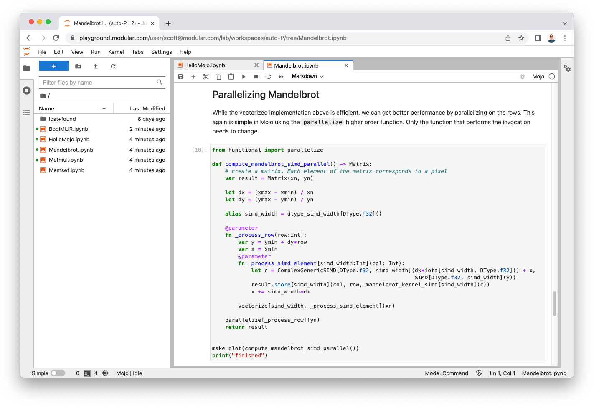

# 开始使用 Mojo🔥

Mojo 现在可以在本地开发！

Mojo SDK 目前可用于 Ubuntu Linux 系统，并且即将支持 Windows 和 macOS。在此之前，我们的安装指南包括如何使用容器或远程 Linux 系统从 Windows 或 macOS 进行开发。您也可以使用我们基于网络的 [Mojo Playground](https://docs.modular.com/mojo/manual/get-started/#develop-in-the-mojo-playground) 尝试 Mojo。

## 获取 Mojo SDK[](#get-the-mojo-sdk)

Mojo SDK 包括本地 Mojo 开发所需的一切，包括 Mojo 标准库和 [Mojo 命令行界面](https://docs.modular.com/mojo/cli/)（CLI）。Mojo CLI 可以启动 REPL 编程环境，编译和运行 Mojo 源文件，格式化源文件等。

我们还发布了 [Visual Studio Code](https://marketplace.visualstudio.com/items?itemName=modular-mojotools.vscode-mojo) 的 Mojo 扩展，以提供一流的开发体验，包括代码完成，快速修复和 Mojo API 的悬停帮助等功能。


### 系统要求[](#system-requirements)

要使用 Mojo SDK，您需要一个符合以下规范的系统：

- Ubuntu 20.04/22.04 LTS
- x86-64 CPU（使用 [SSE4.2 或更高版本](https://www.intel.com/content/www/us/en/support/articles/000057621/processors.html)）和至少 8 GiB 内存
- Python 3.8 - 3.10
- G++ 或 CLang++ C++编译器

对 Windows 和 macOS 的支持将在将来的版本中添加。

### 安装 Mojo[](#install-mojo)

Mojo SDK 可通过 [Modular CLI 工具](https://docs.modular.com/cli/) 获得，该工具可作为安装和更新 Mojo 的包管理器。使用以下链接登录到模块化开发人员控制台，您可以在其中获取 Modular CLI 并安装 Mojo：

[获取 Mojo SDK](https://developer.modular.com/download)

然后从 **[Hello, world!](https://docs.modular.com/mojo/manual/get-started/hello-world.html)** 开始吧！

**注意**：为了帮助我们改进 Mojo，我们收集了一些基本的系统信息和崩溃报告。[了解更多](https://docs.modular.com/mojo/faq.html#does-the-mojo-sdk-collect-telemetry)。

### 更新 Mojo[](#update-mojo)

Mojo 是一项正在进行的工作，我们将定期发布 Mojo 语言和 SDK 工具的更新。有关每个版本的信息，请参阅 [Mojo 更改日志](https://docs.modular.com/mojo/changelog.html)。

要检查您当前的 Mojo 版本，请使用以下选项：`--version`

```
mojo --version
```

要更新到最新的 Mojo 版本，请使用以下命令：`modular update`

```
modular update mojo
```

我们还可能发布该工具的更新，该工具作为 Debian 软件包安装（目前仅适用于 Linux），因此您可以像这样更新它：`modular`

```
sudo apt update

sudo apt install modular
```

## 在 Mojo Playground 开发[](#develop-in-the-mojo-playground)

除了下载 Mojo SDK，您还可以在我们托管的 Jupyter 笔记环境中尝试 Mojo，称为 Mojo Playground。这是 [JupyterLab](https://jupyterlab.readthedocs.io/en/latest/) 的托管版本，运行我们最新的 Mojo 内核。

要获得访问权限，只需 [在此处登录 Mojo Playground](https://playground.modular.com/)。



### 期待什么[](#what-to-expect)

- Mojo Playground 是一个 [JupyterHub](https://jupyter.org/hub) 环境，您可以在其中获得与您的帐户关联的专用卷，因此您可以创建自己的笔记，并且它们将跨会话保存。
- 我们提供了一些笔记，向您展示 Mojo 基础知识并演示其功能。
- 云实例中可用的 vCPU 核心数可能会有所不同，因此基准性能不能代表语言。但是，正如您将在自带的`Matmul.ipynb`笔记中看到的那样，Mojo 对比于 Python 的相对性能非常重要。
- 可能存在一些错误。请在 [GitHub 上报告问题和反馈](https://github.com/modularml/mojo/issues/new/choose)。

### 技巧[](#tips)

- 如果要保留对自带的笔记所做的任何编辑，请**重命名笔记文件**。这些文件将在任何服务器刷新或更新时重置。因此，如果您重命名文件，您的更改将是安全的。
- 您可以在笔记单元格的顶部使用`%%python`，编写普通的 Python 代码。Python 单元中定义的变量、函数和导入可在后续的 Mojo 单元中访问。

### 警告[](#caveats)

- 我们是否提到自带的笔记将丢失您的更改？
  **如果要保存更改，请重命名文件。**
- Mojo 环境没有网络访问权限，因此您无法安装其他工具或 Python 包。但是，我们包含了各种流行的 Python 包，例如 ` numpy`、`pandas` 和 `matplotlib `（请参阅如何 [导入 Python 模块](https://docs.modular.com/mojo/programming-manual.html#python-integration)）。
- 不支持重新定义隐式变量（前面没有 `let` 或 `var` 的变量）。如果要跨笔记单元格重新定义变量，则必须使用 `var`（`let` 变量是不可变的）引入该变量。
- 不能在函数中使用全局变量，它们仅对其他全局变量可见。
- 更多有关尚未生效或有痛点的内容列表，请参阅 [Mojo 路线图](https://docs.modular.com/mojo/roadmap.html)。
